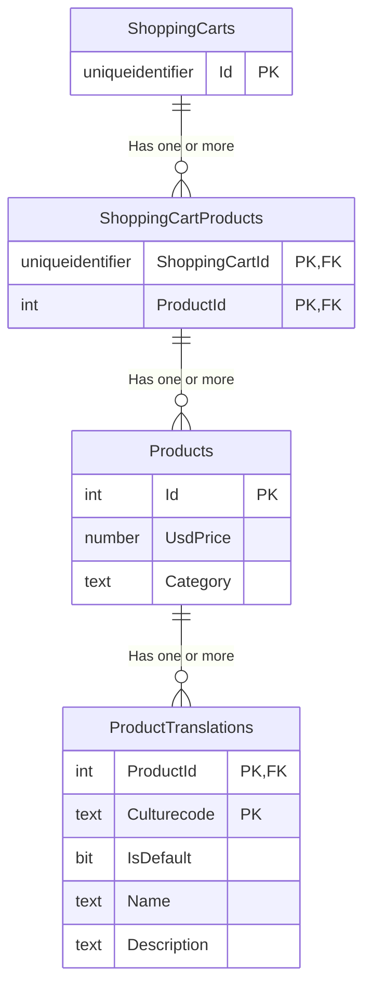
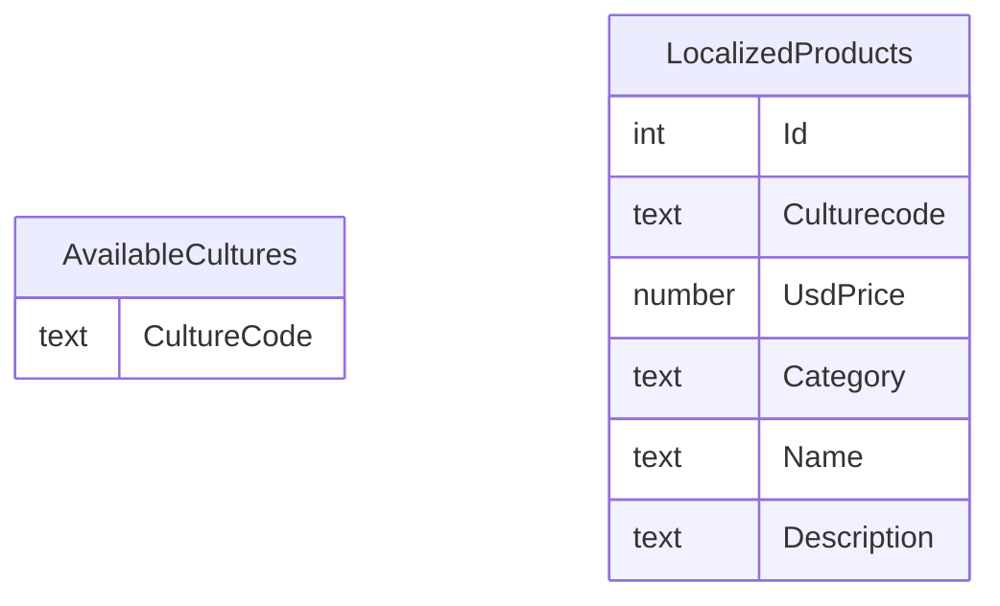

# Localization demo

## Database schema

### Tables

```mermaid
erDiagram
    Products {
        int Id PK
        number UsdPrice
        text Category
    }

    ProductTranslations {
        int ProductId PK,FK
        text Culturecode PK
        bit IsDefault
        text Name
        text Description 
    }

    Products ||--o{ ProductTranslations : "Has one or more"

    ShoppingCarts {
        uniqueidentifier Id PK
    }

    ShoppingCartProducts {
        uniqueidentifier ShoppingCartId PK,FK
        int ProductId PK,FK
    }

    ShoppingCarts ||--o{ ShoppingCartProducts : "Has one or more"
    ShoppingCartProducts ||--o{ Products : "Has one or more"
```

### Views

```mermaid
erDiagram
    AvailableCultures {
        text CultureCode
    }
    LocalizedProducts {
        int Id
        text Culturecode
        number UsdPrice
        text Category
        text Name
        text Description
    }
```
